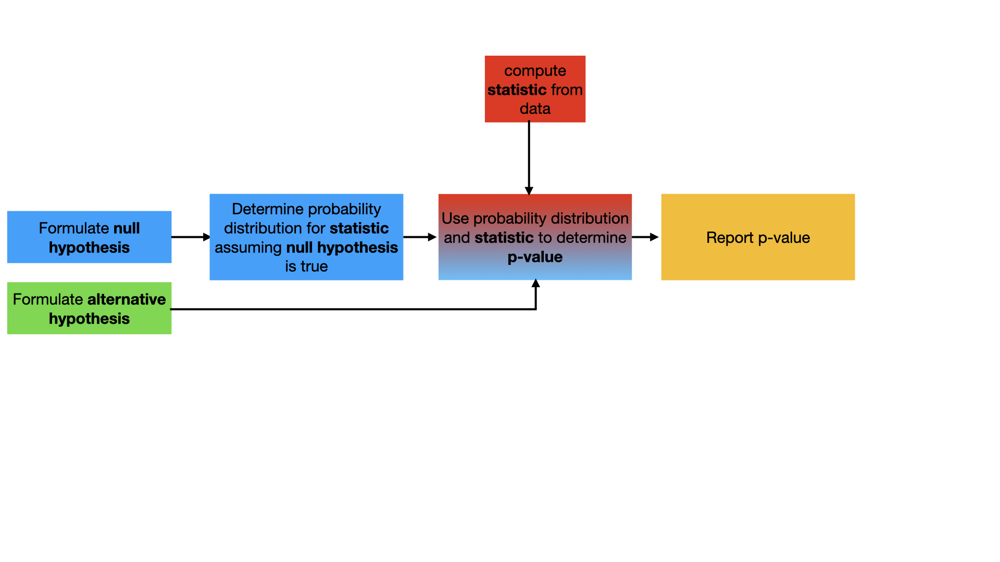

# Two-tailed t-tests

Now that we have familiarised ourselves with the t-distribution lets use it within a hypothesis test.  We are still going to use the workflow given below:

Now, however, the t-distribution that we have just encountered will be used in place of the normal distribution that we have been using in previous exercises.

__To complete this exercise I would like you test whether I am lying when I tell you that the 6 values in the NumPy array called data are all samples from a distribution with an expectation of 7.__  You will thus perform a two-tail test on this data.  Furthermore, notice that you only have 6 data points here as opposed to the often two hundred or more that you were given in the exercises last week.  It is thus too crude to assume that the test statistic:

)

is a sample from a normal distribution under the assumption of the null hypothesis.  You instead need to use the fact that under assumption of the null hypothesis this is should be a sample from a t-distribution with 5 degrees of freedom.

To get you started in completing the exercise I have written two functions for you which you must complete:

1. `testStatistic` - Two variables are passed to this function.  `data` is a NumPy array that contains `N` data points, `mu` is the value of the expectation for the distribution that is assumed under the null hypothesis.  This function should return the test statistic that is defined above.
2. `pvalue` - Two variables are passed to this function.  `data` is a NumPy array that contains `N` data points, mu is the value of the expectation for the distribution that is assumed under the null hypothesis.  The function calls `testStatistic` to evaluate T using the formula above.  You should modify it so that the function returns the __p-value__ based on the value of the __statistic__.
